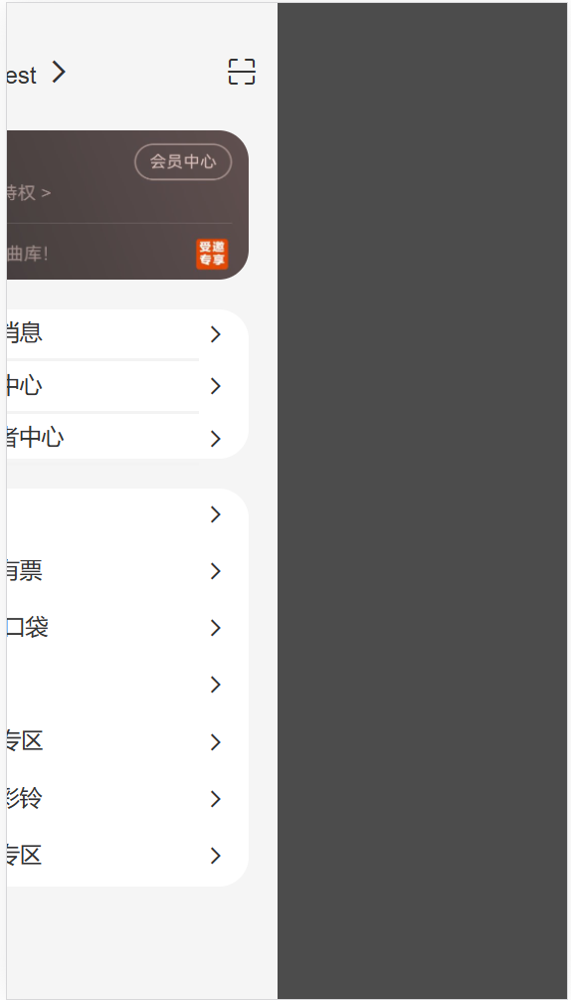
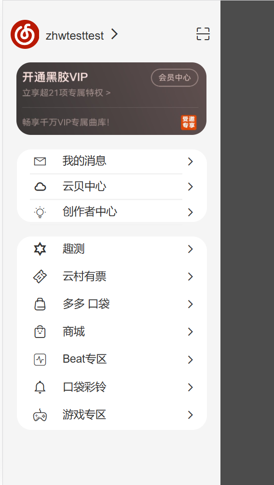
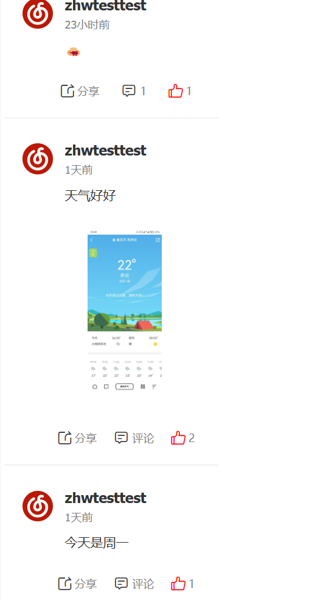
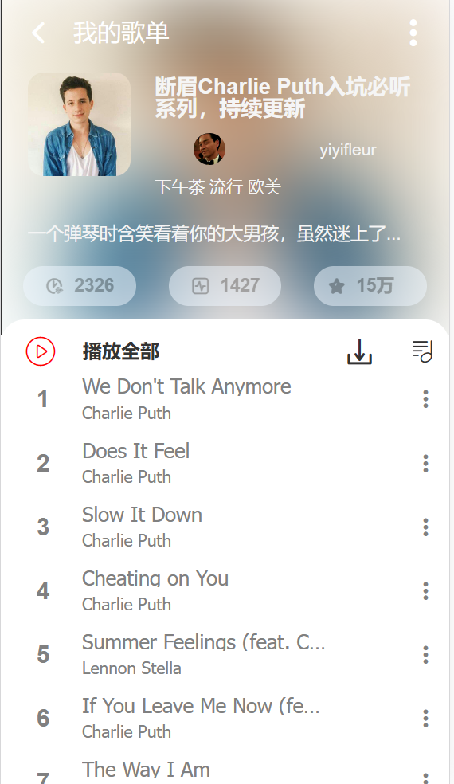
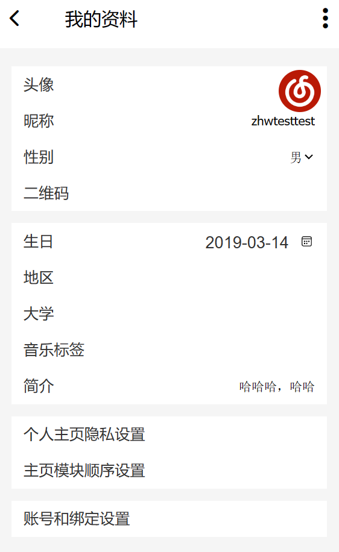

# NetEase-Cloud-Mobile


## 技术栈
vue3 + pina + pinia-plugin-persist+ vue-router + vite + axios + less


## 实现功能
#### 侧边栏
* 主页面点击按钮侧边栏划出，划出后可单指实现侧边栏左右滑动
#### 登录
* 未登录时点击个人头像跳转至登录界面，提供二维码登入，二维码过期可根据提示重新获取
#### 个人页面
* 个人主页展示用户信息，歌单，个人动态页面显示用户动态，支持点赞回复
#### 歌单
* 展示歌曲列表，歌曲列表懒加载，歌曲列表点击播放
#### 信息修改
* 提供头像，生日，性别，个性签名，昵称的修改
## 页面展示







## Project Setup

```sh
npm install
```

### Compile and Hot-Reload for Development

```sh
npm run dev
```

### Compile and Minify for Production

```sh
npm run build
```
